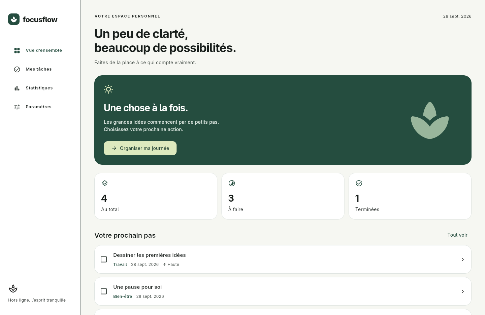
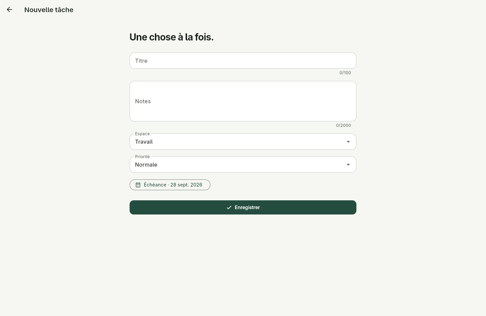
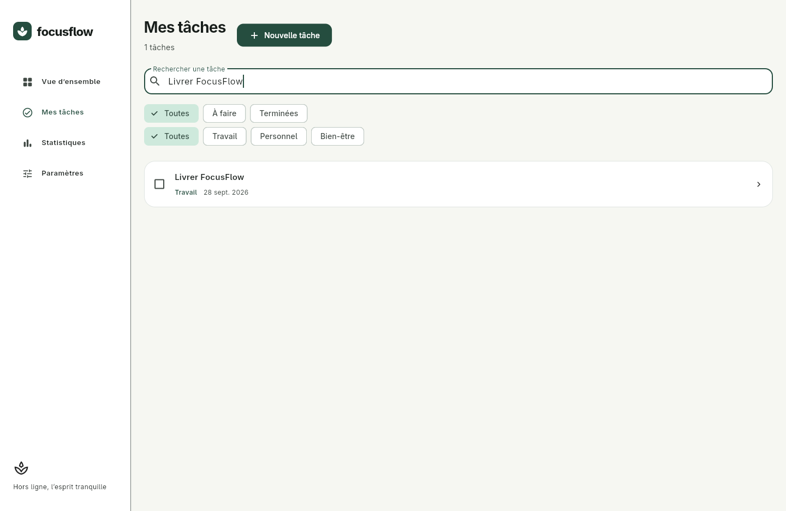
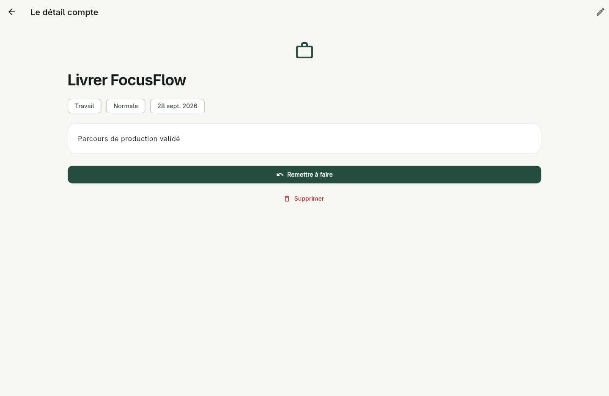
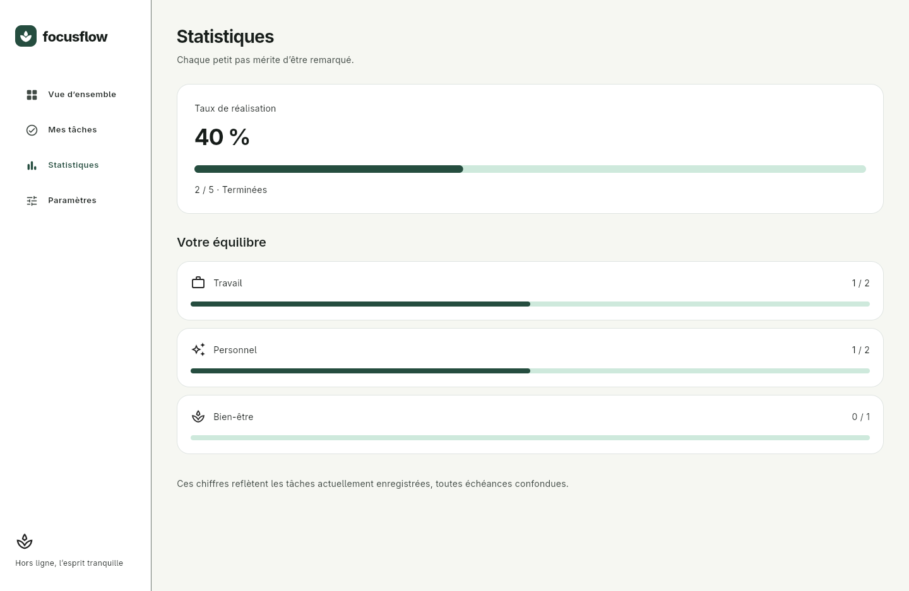
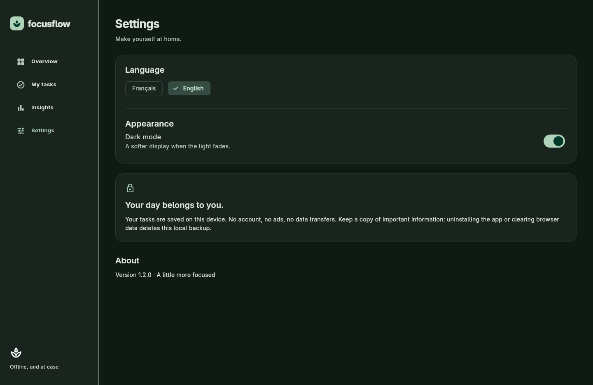
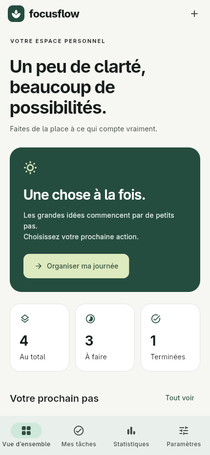
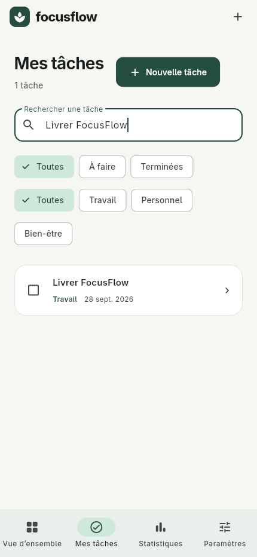
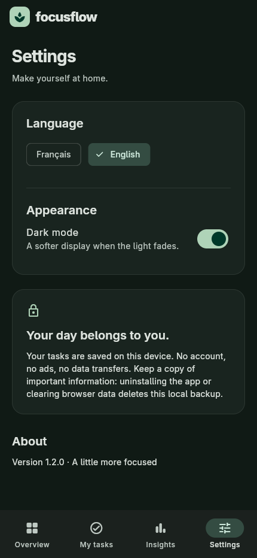

# FocusFlow

**Un peu de clarté, beaucoup de possibilités.** Une application Flutter de gestion de tâches personnelle, en français et en anglais, avec sauvegarde locale et interface adaptative.

[](.github/workflows/ci.yml)


Le badge CI décrit la configuration, pas un résultat d’exécution distant. Après création du dépôt GitHub, remplacer son URL par `https://github.com/OWNER/REPOSITORY/actions/workflows/ci.yml/badge.svg` pour afficher l’état réel. Aucun dépôt distant n’était fourni.

## Aperçu



| Créer une tâche | Retrouver ses tâches |
| --- | --- |
|  |  |

| Détail | Statistiques | Anglais et thème sombre |
| --- | --- | --- |
|  |  |  |

### Sur mobile

  

Captures produites par les tests d’intégration sur un navigateur réel, et non par des maquettes.

## Fonctionnalités

1. **Accueil** : prochaines tâches, compteurs, accès aux espaces.
2. **Mes tâches** : recherche dans les titres/notes, filtres par état et catégorie, liste paresseuse.
3. **Détail** : notes, échéance, priorité, validation/réouverture et suppression confirmée.
4. **Création / modification** : validation, date native localisée, conservation des saisies en cas d’erreur.
5. **Statistiques** : taux de réalisation et répartition par espace, calculés sur les données présentes.
6. **Paramètres** : français/anglais et thème clair/sombre persistants, explication du stockage.

Travail, Personnel, Bien-être ; états vide, chargement, aucun résultat et erreur ; navigation latérale sur bureau et barre inférieure sur mobile. Les tâches d’exemple sont créées uniquement au premier lancement. Les contenus saisis ne sont pas traduits automatiquement.

## Installation

Prérequis : **Flutter 3.41.9 / Dart 3.11.5**, Chrome/Chromium pour le web ; Android SDK et JDK 17 pour Android ; macOS/Xcode pour iOS.

```sh
flutter pub get --enforce-lockfile
flutter gen-l10n
flutter run -d chrome
# ou : flutter run -d <identifiant-appareil>
```

Aucun compte, secret API ou backend n’est nécessaire. `pubspec.lock` est inclus pour reproduire les versions. Vérifier l’environnement avec `flutter doctor -v`.

## Architecture

```text
lib/
  domain/task.dart          Modèle immuable, validation, filtres, statistiques
  data/app_repository.dart  Contrat injectable et stockage JSON versionné
  state/app_controller.dart État, mutations, erreurs et préférences observables
  ui/app.dart               Thèmes, navigation adaptative, racine de l’application
  ui/screens.dart           Six écrans et formulaire partagé création/édition
  ui/components.dart        Widgets réutilisables et formatage localisé
  l10n/app_{fr,en}.arb       Sources de traduction Flutter gen-l10n
```

Les widgets appellent le contrôleur, qui valide puis écrit via le repository. Le nouvel état n’est publié qu’après réussite de la sauvegarde. Une écriture échouée conserve le dernier état validé ; une lecture invalide conserve les données et affiche un réessai. Les tests utilisent une horloge injectée et un repository mémoire ; l’intégration utilise le véritable adaptateur SharedPreferences.

`ChangeNotifier` suffit à cet état local, sans framework supplémentaire. Un `ValueNotifier` distinct limite les reconstructions de `MaterialApp` aux changements de langue/thème. Les constructeurs `const` et les listes `builder` limitent le travail du rendu.

## Tests et qualité

```sh
flutter analyze --no-pub --fatal-infos
flutter test --no-pub --coverage
python3 scripts/check_coverage.py
# Analyse, tests et build web regroupés :
./scripts/verify.sh
```

- **32 tests unitaires** : modèles, validation, filtres, statistiques, repository, corruption, erreurs et concurrence des sauvegardes.
- **13 tests widgets** : navigation, formulaire, recherche, filtres, langue, thème, confirmation, erreurs, écran de 320 px et texte à 200 %, accessibilité.
- **2 tests d’intégration** : création → validation → rechargement du stockage ; édition → langue/thème → redémarrage du contrôleur → suppression confirmée.
- **1 scénario de performance** : 1 000 tâches en mode profile, avec export des temps de construction et de rasterisation.
- Seuil CI : **90 % de couverture des lignes métier** (`domain`, `data`, `state`), sans gonfler le résultat avec les fichiers de traduction générés.

### Intégration web

Installer Chrome et le ChromeDriver de version correspondante, puis :

```sh
CHROME_BINARY=/chemin/vers/chrome \
CHROMEDRIVER=/chemin/vers/chromedriver \
./scripts/test_web.sh
```

Le script démarre et arrête ChromeDriver, exécute les deux parcours et régénère les captures. Utiliser un profil/appareil de test : la suite réinitialise uniquement la clé de données FocusFlow. Sur Android : `flutter test integration_test/app_test.dart -d DEVICE_ID` (sans l’option `SCREENSHOTS`).

Les preuves et limites de validation sont consignées dans [docs/VALIDATION.md](docs/VALIDATION.md).

## Performance et accessibilité

Photos **WebP 640 × 400**, embarquées et décodées à la demande avec `cacheWidth`, liste de tâches paresseuse et police locale. Voir les [sources des assets](docs/ASSETS.md).

Les boutons natifs exposent leurs libellés ; les cases de validation, liens de tâche et indicateurs ont une sémantique explicite. Les tests vérifient les cibles tactiles Android et leurs libellés. Le texte à 200 % est testé sur les quatre destinations de navigation. Une recette TalkBack/VoiceOver sur appareil reste nécessaire.

Le benchmark Linux natif a mesuré **411 frames**, avec un p99 de **2,064 ms** en construction et **2,474 ms** en rasterisation, sans dépassement de budget sur ce passage. Le projet est optimisé pour viser 60 FPS, mais **60 FPS constants ne sont pas certifiés sans profilage physique**. Le [protocole et le benchmark](docs/PERFORMANCE.md) sont fournis, avec un budget p99 de 16,67 ms.

## CI/CD et livraison

[Flutter CI](.github/workflows/ci.yml) exécute sur push/PR : formatage, analyse stricte, tests, couverture, intégration Chrome, puis produit l’archive web release et un bundle Android non signé. Aucun secret n’est requis pour ces contrôles.

[Deploy web to GitHub Pages](.github/workflows/deploy.yml) permet une publication manuelle, précédée des mêmes validations. Activer GitHub Pages avec la source GitHub Actions avant son premier lancement.

```sh
flutter build web --release --no-pub --no-web-resources-cdn
flutter build appbundle --release
```

Consulter [la procédure de production](docs/PRODUCTION.md) pour la signature Android, iOS, l’hébergement, le stockage et les contrôles avant publication. La version web fonctionne sans réseau après chargement, mais sa réouverture hors ligne n’est pas garantie. Les ressources natives sont embarquées.

## Historique

[CHANGELOG.md](CHANGELOG.md) documente les incréments **1.0.0**, **1.1.0** et **1.2.0** réalisés pour ce projet. Ils ne correspondent pas à des publications déjà effectuées sur les stores.
